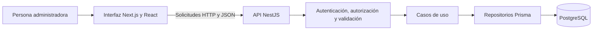
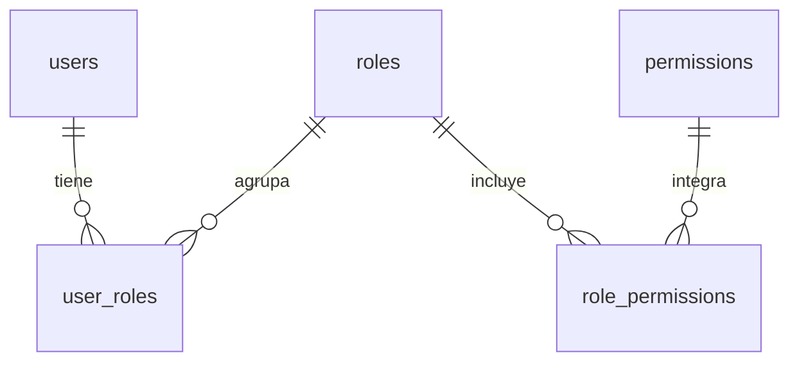

# Marco teórico y desarrollo

**Proyecto:** SIPLAP-Booked  
**Fecha de corte:** 25 de septiembre de 2026  
**Alcance:** documentación del avance disponible en el repositorio.

El presente documento describe los fundamentos técnicos, el procedimiento de desarrollo y los productos obtenidos en la etapa inicial de SIPLAP-Booked. El avance se concentra en la autenticación de superusuarios y la administración de usuarios, roles y permisos. El modelo de datos también contempla actividades, reservaciones, espacios y recursos; estas estructuras representan una base para las siguientes etapas y no acreditan, por sí mismas, la existencia de módulos operativos.

## 1. Marco teórico

### 1.1. Sistemas de información y gestión de procesos

Un sistema de información organiza datos y operaciones para apoyar las actividades de una organización. Su utilidad depende de que la información pueda registrarse, consultarse y actualizarse de manera coherente, con responsabilidades definidas para quienes la utilizan.

En SIPLAP-Booked, este enfoque se refleja en un modelo de datos que relaciona usuarios, departamentos, actividades, requerimientos y reservaciones. La administración de identidades constituye la primera base del sistema: antes de habilitar procesos operativos, es necesario determinar quién puede ingresar y administrar su configuración.

### 1.2. Arquitectura cliente-servidor y separación de responsabilidades

En una arquitectura cliente-servidor, la interfaz presenta información y envía solicitudes, mientras que el servidor procesa las operaciones y controla el acceso a los datos. Esta separación permite modificar la presentación sin concentrar en ella las reglas de negocio.

El proyecto utiliza Next.js y React para la interfaz, NestJS para el servidor y PostgreSQL para la persistencia. El frontend se comunica con una API HTTP e intercambia información en formato JSON. Las operaciones administrativas utilizan GET para consultar, POST para crear o asignar, PATCH para actualizar parcialmente y DELETE para eliminar.

El backend se organiza en cuatro capas:

| Capa | Responsabilidad | Aplicación en el proyecto |
| --- | --- | --- |
| Dominio | Definir entidades y contratos independientes de la infraestructura. | Entidades de usuario, rol y permiso; puertos de repositorios. |
| Aplicación | Ejecutar las operaciones y reglas de cada caso de uso. | Crear usuarios, actualizar roles y asignar permisos. |
| Infraestructura | Implementar acceso a datos y servicios técnicos. | Repositorios Prisma, bcrypt y emisión de tokens. |
| Presentación | Recibir solicitudes y producir respuestas HTTP. | Controladores, guards, validación y traducción de errores. |

La estructura aplica separación de responsabilidades e inversión de dependencias: los casos de uso trabajan con contratos y reciben sus implementaciones mediante inyección. Esto facilita sustituir componentes y verificar comportamientos de forma aislada. NestJS proporciona la organización mediante módulos, controladores y proveedores que sirve de soporte a esta implementación. [Documentación de NestJS](https://docs.nestjs.com/techniques).

### 1.3. Control de acceso basado en roles

El control de acceso basado en roles, conocido como RBAC, vincula usuarios con roles y roles con permisos. Un rol reúne las autorizaciones asociadas a una función organizacional y permite administrarlas de manera conjunta. Este modelo constituye el fundamento del módulo de administración de acceso. [NIST: Role-Based Access Control](https://csrc.nist.gov/Projects/Role-Based-Access-Control/faqs).

El modelo del proyecto contiene las entidades `users`, `roles` y `permissions`, junto con las tablas de asociación `user_roles` y `role_permissions`. Estas relaciones permiten que un usuario tenga varios roles y que un rol agrupe varios permisos.

En la implementación actual, las rutas administrativas exigen un JWT válido y el rol `SUPERUSUARIO`. Aunque ya se pueden registrar y asignar permisos, el código revisado no implementa todavía una evaluación general de cada permiso para autorizar operaciones de todos los futuros módulos. Por ello, el resultado actual corresponde a la administración de RBAC y a la protección del panel por rol.

### 1.4. Autenticación y protección de credenciales

La autenticación verifica la identidad de una persona; la autorización determina las operaciones que puede realizar. El acceso actual comprueba correo y contraseña, verifica que la cuenta tenga estado `ACTIVE` y confirma la pertenencia al rol `SUPERUSUARIO`.

Las contraseñas se procesan mediante bcrypt y se almacenan como hashes, no como texto legible. Al autenticar, se compara la contraseña proporcionada con el hash almacenado. Tras un acceso válido, el servidor emite un JWT que el cliente adjunta en el encabezado `Authorization` con el esquema `Bearer`.

El JWT permite verificar la autenticidad de las afirmaciones incluidas en el token; su uso no equivale a cifrar su contenido. El frontend actual conserva el token en el almacenamiento local del navegador y lo elimina al cerrar sesión. Estas características describen la implementación disponible, sin constituir una certificación integral de seguridad.

### 1.5. Modelo relacional e integridad de datos

El modelo relacional organiza los datos en tablas vinculadas mediante claves. Las claves primarias identifican registros, las claves foráneas mantienen las referencias entre tablas y las restricciones de unicidad impiden valores duplicados en atributos que deben ser exclusivos. [PostgreSQL: Constraints](https://www.postgresql.org/docs/17/ddl-constraints.html).

En SIPLAP-Booked se utilizan identificadores UUID y relaciones entre las entidades. El esquema define unicidad para el correo del usuario, el nombre del rol y el identificador textual del permiso, denominado `slug`. Una migración incorpora los índices correspondientes a la base existente.

Los adaptadores de persistencia utilizan transacciones en eliminaciones que también afectan asignaciones. Esto permite conservar la consistencia si otra relación impide completar la operación. Prisma constituye la capa de acceso entre el código del backend y PostgreSQL.

### 1.6. Validación, contratos compartidos y calidad

La validación comprueba que los datos cumplan las reglas esperadas antes de procesarlos. El paquete `@shared/contracts` reúne esquemas Zod y tipos TypeScript para las operaciones administrativas. Se verifican formatos de correo y UUID, longitudes, campos admitidos y actualizaciones no vacías. La contraseña de creación debe tener al menos ocho caracteres y respetar el límite de 72 bytes establecido por el contrato.

Compartir contratos ayuda a mantener criterios consistentes entre componentes, mientras que la validación del servidor controla las solicitudes recibidas. Las pruebas automatizadas complementan este mecanismo mediante escenarios válidos, entradas incorrectas, accesos no autorizados y conflictos de datos.

## 2. Procedimiento y actividades

### 2.1. Enfoque metodológico

Para organizar la continuidad del proyecto se propone un enfoque incremental: desarrollar un conjunto acotado de funciones, integrarlo, verificarlo y documentarlo antes de ampliar el alcance. El primer incremento identificable corresponde al acceso y a la administración de usuarios, roles y permisos.

La secuencia siguiente se reconstruye a partir de los componentes disponibles. No supone que exista evidencia de ceremonias Scrum, entrevistas, fechas de ejecución o validaciones institucionales que no estén documentadas.

### 2.2. Procedimiento paso a paso

1. **Delimitar las funciones iniciales.** Establecer el acceso de superusuario, las operaciones de alta, consulta, modificación y eliminación, y las relaciones usuario-rol y rol-permiso. Definir restricciones como impedir la eliminación de la cuenta que ejecuta la operación y proteger el rol reservado.

2. **Revisar el modelo de datos existente.** Identificar entidades, claves y dependencias en el esquema Prisma. Separar las tablas utilizadas por el incremento de las estructuras destinadas a actividades y reservaciones.

3. **Organizar el entorno de desarrollo.** Distribuir el código en `frontend`, `backend` y `packages/shared`; coordinar las tareas con pnpm y Turborepo y configurar la conexión a la base de datos, el secreto JWT y la dirección de la API mediante variables de entorno.

4. **Definir contratos de entrada.** Establecer los campos y reglas de creación, actualización y asignación. Incorporar validación estricta, normalización de valores y mensajes que permitan identificar errores de captura.

5. **Implementar autenticación y control de acceso.** Consultar al usuario, comparar su contraseña, verificar estado y rol, emitir el token y proteger los recursos administrativos mediante guards.

6. **Desarrollar los casos de uso y la persistencia.** Implementar las operaciones administrativas mediante puertos y repositorios. Incluir manejo de registros inexistentes, duplicados, dependencias y transacciones.

7. **Integrar la interfaz.** Construir el formulario de acceso y el panel administrativo. Incorporar formularios, tablas, selectores de asignación, estados de carga, mensajes de respuesta y confirmaciones de eliminación.

8. **Preparar la verificación.** Incorporar pruebas HTTP para acceso, validación, operaciones, reglas protegidas y conflictos. Mantener una prueba específica para PostgreSQL local que cree y retire sus propios registros de prueba.

9. **Documentar el incremento y sus límites.** Registrar rutas, comandos, configuración, reglas de negocio y productos obtenidos. Definir las siguientes funciones y sus criterios de aceptación antes de ampliar el sistema.

### 2.3. Cronograma propuesto

El siguiente cronograma es una propuesta de ocho semanas para organizar el incremento y su cierre. Las semanas son relativas al inicio que acuerde el equipo; no representan fechas históricas ni duraciones medidas. La columna de evidencia distingue los componentes presentes de las actividades cuya conclusión aún requiere verificación.

| Etapa | Periodo propuesto | Actividades | Entregable | Evidencia al corte |
| --- | --- | --- | --- | --- |
| Alcance | Semana 1 | Precisar actores, operaciones y reglas. | Requisitos y criterios de aceptación. | Reglas reflejadas en código; aprobación formal no documentada. |
| Diseño | Semana 2 | Revisar arquitectura y relaciones de datos. | Esquema técnico y modelo de datos. | Capas y esquema Prisma presentes. |
| Acceso | Semana 3 | Implementar autenticación, hashes y guards. | Acceso de superusuario. | Código de servidor y pantalla presentes. |
| Administración | Semanas 4 y 5 | Construir CRUD, asignaciones y restricciones. | API y panel administrativo. | Implementaciones presentes. |
| Integración | Semana 6 | Unificar validaciones y manejo de respuestas. | Contratos y comunicación cliente-servidor. | Contratos y cliente de API presentes. |
| Verificación | Semana 7 | Ejecutar pruebas, revisar errores y validar flujos. | Registro de resultados y correcciones. | Pruebas disponibles; ejecución no repetida para este documento. |
| Cierre del incremento | Semana 8 | Completar manuales y validar con responsables. | Informe y aceptación del incremento. | Nota técnica existente y presente documento; aceptación pendiente de evidencia. |

## 3. Resultados

### 3.1. Productos técnicos obtenidos

La revisión identifica un incremento de software centrado en la administración de acceso. Los resultados comprobables son archivos de código, estructuras de datos, interfaces implementadas y documentación técnica.

| Producto | Resultado disponible | Evidencia en el repositorio |
| --- | --- | --- |
| Arquitectura de software | Separación de interfaz, servidor y contratos; backend organizado por capas. | `frontend`, `backend/src`, `packages/shared`. |
| Modelo de datos | Entidades de acceso y estructuras para actividades, reservaciones, espacios y recursos. | `backend/prisma/schema.prisma`. |
| Acceso administrativo | Validación de credenciales, estado activo y rol; emisión de JWT. | `backend/src/auth`, `frontend/src/app/login/page.tsx`. |
| Administración de usuarios | Creación, consulta, actualización, eliminación y asignación de roles. | `backend/src/users`. |
| Administración de roles y permisos | Operaciones CRUD y asignación de permisos a roles. | `backend/src/roles`, `backend/src/permissions`. |
| Interfaz administrativa | Formularios, tablas, edición, eliminación y selectores de asignación. | `frontend/src/app/admin/page.tsx`. |
| Contratos compartidos | Esquemas de validación y tipos de las operaciones administrativas. | `packages/shared/src/index.ts`. |
| Integridad de registros | Migración con índices únicos para correo, nombre de rol y slug. | `backend/prisma/migrations/20260923000000_rbac_unique_keys/migration.sql`. |
| Pruebas automatizadas | Prueba de salud, seis pruebas HTTP de RBAC y script de integración con PostgreSQL local. | `backend/src/app.controller.spec.ts`, `backend/test`. |
| Documentación técnica | Instrucciones de entorno, capas, API, migración y verificación. | `docs/RBAC-01.md`. |

### 3.2. Esquemas técnicos

En este proyecto, los esquemas de arquitectura y de relaciones cumplen la función de representar el diseño del software. Los siguientes diagramas se elaboran para este documento a partir del código revisado.

El segundo esquema representa únicamente las relaciones del módulo RBAC. Las tablas intermedias permiten asociaciones de muchos a muchos.

### 3.3. Análisis del avance

La implementación proporciona una base para administrar identidades y configurar roles antes de incorporar procesos operativos. Incluye reglas concretas: conservar la contraseña al omitirla en una actualización, impedir renombrar o eliminar `SUPERUSUARIO`, impedir que una cuenta se elimine a sí misma y comunicar conflictos de datos mediante respuestas HTTP.

Las seis pruebas HTTP disponibles cubren protección de rutas, validación de entradas, operaciones sobre roles y permisos, edición de usuarios, protección del rol reservado y de la cuenta propia, y traducción de errores de unicidad a conflictos HTTP. Su existencia aporta mecanismos de verificación; no sustituye un registro de ejecución. Para esta documentación se realizó revisión estática de archivos y no se volvieron a ejecutar pruebas ni se validó el despliegue.

No se dispone de mediciones que permitan afirmar una reducción de tiempos administrativos, un porcentaje de eficiencia, capacidad de usuarios concurrentes o satisfacción de usuarios. Tales resultados requieren pruebas y mediciones posteriores.

### 3.4. Guía breve de uso del incremento

Esta guía se deriva del flujo implementado y presupone que la aplicación está en ejecución y existe una cuenta activa con el rol `SUPERUSUARIO`.

1. Abrir la ruta `/login`, capturar las credenciales y enviar el formulario.
2. Al ingresar al panel `/admin`, consultar las tablas de usuarios, roles y permisos.
3. Utilizar el formulario correspondiente para crear registros. Para usuarios, proporcionar correo y contraseña conforme a las reglas de validación.
4. Seleccionar **Editar**, modificar los campos y pulsar **Guardar cambios**. Utilizar **Cancelar edición** para abandonar la captura. Omitir la contraseña si se desea conservar la actual.
5. Elegir usuario y rol para realizar una asignación; elegir rol y permiso para asociar una autorización.
6. Para eliminar un registro, seleccionar **Eliminar** y confirmar. La operación puede rechazarse por reglas protegidas o dependencias existentes.
7. Revisar los mensajes de resultado y cerrar sesión al terminar.

La preparación del entorno, los comandos y las condiciones de la migración se describen en [RBAC-01](RBAC-01.md). La migración disponible presupone una base existente y no constituye un procedimiento completo para instalar el esquema desde una base vacía.

### 3.5. Alcance pendiente

La siguiente etapa debe definir e implementar los flujos de actividades, requerimientos, reservaciones, espacios, recursos y reportes que actualmente solo están representados en el modelo de datos. También debe precisar la autorización por permiso para cada operación, realizar validaciones con usuarios y registrar los resultados de aceptación.

Los productos actuales sustentan el avance inicial del sistema. La finalización de la plataforma completa y sus beneficios operativos deberán acreditarse con la integración de los módulos restantes y evidencia de su funcionamiento.

## Referencias

- National Institute of Standards and Technology. *Role-Based Access Control: FAQs*. https://csrc.nist.gov/Projects/Role-Based-Access-Control/faqs
- NestJS. *Documentación oficial*. https://docs.nestjs.com/techniques
- PostgreSQL Global Development Group. *PostgreSQL 17 Documentation: Constraints*. https://www.postgresql.org/docs/17/ddl-constraints.html
- SIPLAP-Booked. Código fuente, esquema Prisma, contratos compartidos, pruebas y nota técnica `docs/RBAC-01.md`. Revisión documental con corte al 25 de septiembre de 2026.
